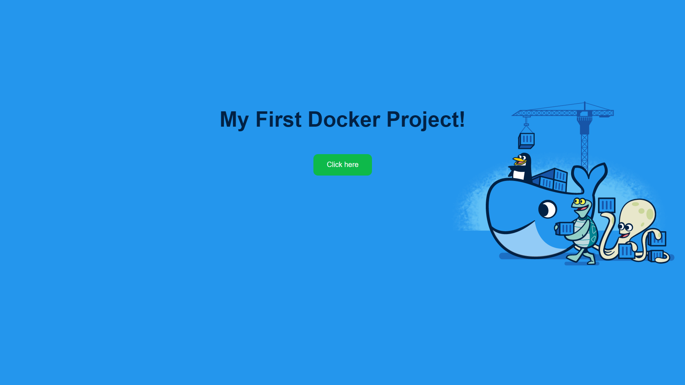

# Projeto Docker Apache

Este é um projeto simples que demonstra como rodar uma página HTML estática usando **Docker** e o servidor **Apache**.



## Descrição do Projeto

- Página HTML básica com CSS para estilo.
- Executa dentro de um container Docker com Apache (`httpd`).

## Como Rodar

1. Certifique-se de ter o **Docker** instalado.
2. Abra o terminal na pasta raiz do projeto.
3. Rode o comando:

```bash
docker-compose up -d
